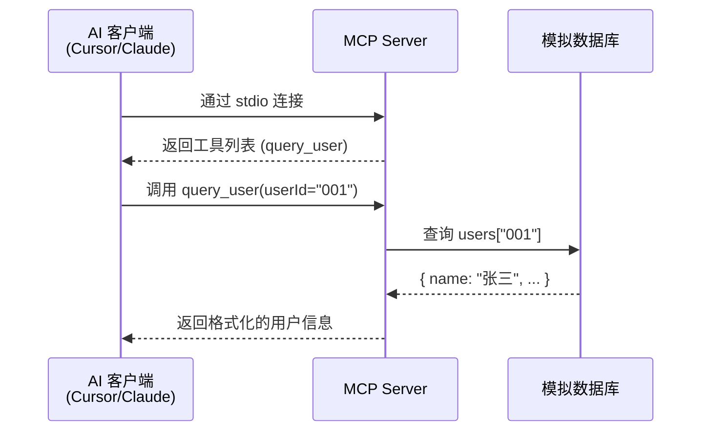

# 从 Tool 开始：让大模型自动调工具读文件
整体流程
1.初始化大模型
2.创建工具函数，并绑定到到模型
3.设定人设以及用户问题
4.执行第一轮调用，并放在历史中，拿到tool_calls，存在则代表大模型想要继续执行
5.循环tool_calls，依次调用对应的工具，并拿到执行的结果
6.将工具执行结果以及工具id存储到历史对话
7.根据历史记录再次进行调用，并输出最终结果

Read [](file:///Users/wuhan/wh/sg-agent-course/ai-agent-learning/tool-test/src/my-mcp-server.mjs)


# my-mcp-server.mjs 代码详解  2026-07-01

这是一个 **MCP（Model Context Protocol）服务器**，它能将自定义工具暴露给 AI 客户端（如 Cursor、Claude Desktop 等），让 AI 可以调用这些工具。

---

### 1. 导入依赖

```js
import { McpServer } from '@modelcontextprotocol/sdk/server/mcp.js';
import { StdioServerTransport } from '@modelcontextprotocol/sdk/server/stdio.js';
import { z } from 'zod';
```

- **`McpServer`**：MCP 服务器的核心类，用于创建服务器实例、注册工具和资源。
- **`StdioServerTransport`**：通过**标准输入/输出（stdin/stdout）**与客户端通信，这是 MCP 最常用的传输方式。
- **`z`（Zod）**：用于定义工具参数的 Schema，进行类型校验和自动生成参数描述。

---

### 2. 模拟数据库

```js
const database = {
  users: {
    '001': { id: '001', name: '张三', email: 'zhangsan@example.com', role: 'admin' },
    '002': { id: '002', name: '李四', email: 'lisi@example.com', role: 'user' },
    '003': { id: '003', name: '王五', email: 'wangwu@example.com', role: 'user' },
  }
};
```

一个简单的内存对象模拟数据库，包含 3 个用户，每个用户有 `id`、`name`、`email`、`role` 字段。

---

### 3. 创建 MCP 服务器

```js
const server = new McpServer({
  name: 'my-mcp-server',
  version: '1.0.0',
});
```

初始化服务器，指定名称和版本号。

---

### 4. 注册工具：`query_user`

```js
server.registerTool('query_user', {
  description: '查询数据库中的用户信息...',
  inputSchema: {
    userId: z.string().describe('用户 ID...'),
  },
}, async ({ userId }) => { ... });
```

核心部分，注册了一个名为 `query_user` 的工具：

| 组成部分 | 说明 |
|---------|------|
| **工具名** | `query_user`，AI 客户端通过这个名字调用 |
| **description** | 描述工具的用途，AI 根据这个决定何时调用 |
| **inputSchema** | 用 Zod 定义参数 `userId`（字符串类型） |
| **处理函数** | 异步函数，根据 `userId` 查库，返回用户信息或错误提示 |

返回格式遵循 MCP 协议：
```js
{ content: [{ type: 'text', text: '...' }] }
```

---

### 5. 注册资源：使用指南

```js
server.registerResource('使用指南', 'docs://guide', {
  description: 'MCP Server 使用文档',
  mimeType: 'text/plain',
}, async () => { ... });
```

注册一个**资源**（Resource），不同于工具——资源是 AI 可以主动"读取"的内容（如文档、配置文件等），这里是 `docs://guide` 这个 URI 指向的使用说明。

---

### 6. 启动服务器

```js
const transport = new StdioServerTransport();
await server.connect(transport);
```

创建 stdio 传输层并连接服务器。此时服务器开始监听 stdin，等待 AI 客户端通过 stdout 发送请求。

---

### 整体流程



简而言之：这个文件实现了一个 MCP 服务器，向 AI 提供了一个**用户查询工具**，AI 可以用自然语言对话的方式自动调用它来查询用户信息。

## 这里的 AI 客户端是可以理解成用户吗？
**不完全一样，但可以类比理解。** 更准确地说，AI 客户端是用户和 MCP 服务器之间的**中间代理**。

---

### 三者关系

```
用户（你）  ──自然语言──▶  AI 客户端（Cursor/Claude）  ──MCP协议──▶  MCP 服务器
```

| 角色 | 做什么 |
|------|--------|
| **用户** | 用自然语言提需求，比如"帮我查一下 001 号用户是谁" |
| **AI 客户端** | 理解用户意图，决定调用哪个工具，发送 MCP 请求 |
| **MCP 服务器** | 执行具体逻辑（查数据库），返回结果 |

---

### 关键区别

- **用户不直接调 MCP 服务器**，用户只跟 AI 对话。
- **AI 客户端才是 MCP 服务器的直接调用者**，它根据用户的话自动选择工具并调用。
- 文件第 51 行 `server.connect(transport)` 连接的是 **AI 客户端进程**（比如 Cursor），而不是终端用户。

所以可以这样理解：**AI 客户端是用户的"手脚"，替用户去调用工具；MCP 服务器是"工具箱"，提供具体能力。**