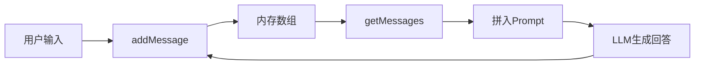
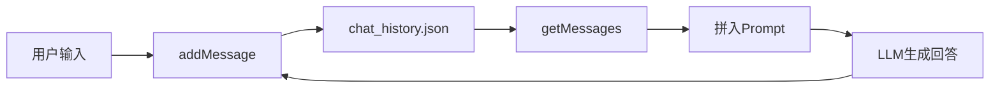
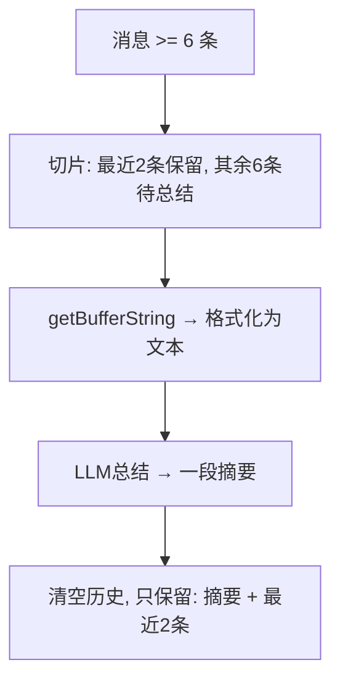
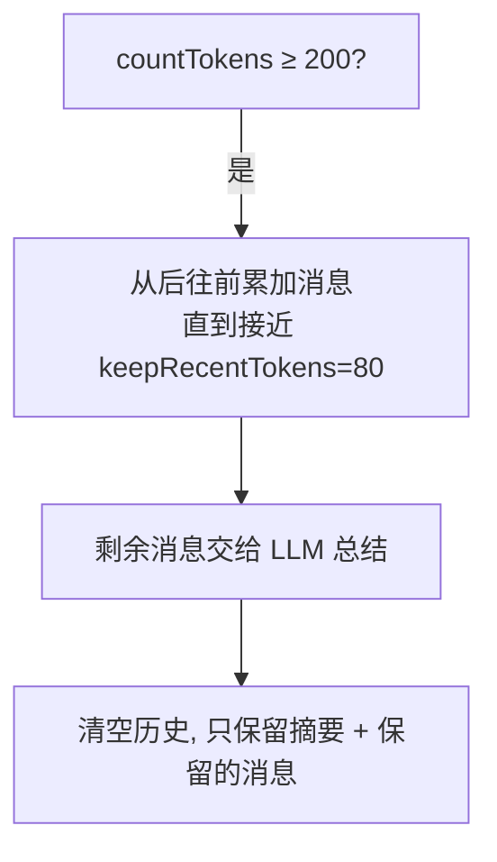
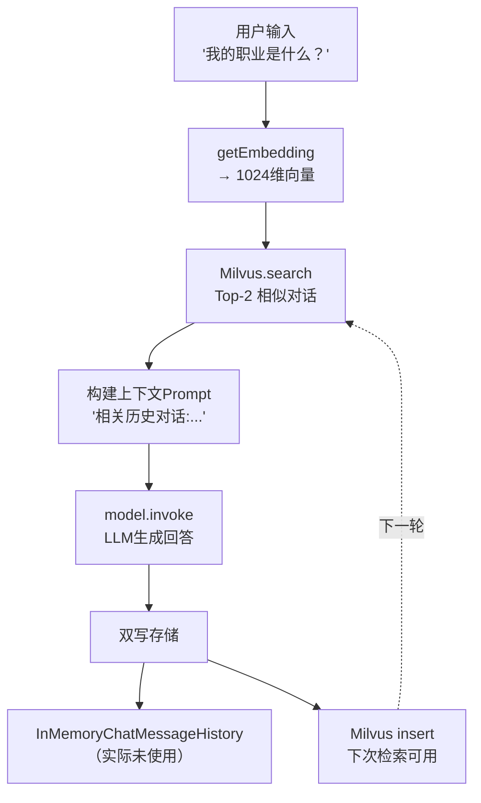

# AI Agent 记忆管理学习笔记

## 项目概览

本项目系统学习 AI Agent 中的**对话记忆管理**策略，从简单到复杂，覆盖了 4 种核心记忆模式。

基于 LangChain + Milvus 向量数据库，使用 OpenAI 兼容的 Chat 模型和 Embedding 模型。

### 依赖

```
@langchain/core        - LangChain 核心库（消息类型、聊天历史）
@langchain/openai      - OpenAI Chat + Embedding 模型
@langchain/community   - 社区贡献（FileSystemChatMessageHistory）
@zilliz/milvus2-sdk-node - Milvus 向量数据库客户端
js-tiktoken            - Token 计数工具
dotenv                 - 环境变量管理
```

---

## 一、基础对话历史管理

### 1.1 内存存储（history-test.mjs）

**策略**：`InMemoryChatMessageHistory`

最简单的记忆方式，将所有对话保存在**进程内存**中。



- 特点：速度快、实现简单
- 缺点：**程序重启即丢失**，无法跨会话复用
- 演示了 2 轮做菜助手对话，通过 `history.getMessages()` 获取完整历史

### 1.2 文件持久化（history-test2.mjs）

**策略**：`FileSystemChatMessageHistory`

将对话保存到 **JSON 文件**中，实现跨会话持久化。



- 数据格式：`{ "sessionId": { "messages": [...] } }`
- 特点：结构化存储，按 sessionId 隔离不同会话

### 1.3 会话恢复与续接（history-test3.mjs）

**策略**：从文件恢复后继续对话

- 先从 `chat_history.json` 中 `getMessages()` 恢复之前的对话
- 在已恢复的历史基础上进行**第 3 轮对话**
- 新对话自动追加到同一文件中

**小结**：这三个文件演示了对话历史的"无记忆 → 文件持久化 → 跨会话续接"的演进。

---

## 二、记忆管理策略

当对话越来越长，上下文窗口（Context Window）有限，必须对历史消息做取舍。

### 2.1 截断策略（truncation-memory.mjs）

**核心理念**：只保留最近的 N 条消息，旧消息直接丢弃。

模拟了 10 条"张三"的自我介绍对话，演示两种截断方式：

| 方式 | 逻辑 | 适用场景 |
|------|------|----------|
| **按消息数量截断** | 保留最近 `maxMessages` 条 | 简单直接，消息长度均匀 |
| **按 Token 数截断** | 使用 `trimMessages` + `js-tiktoken` + `strategy: "last"` | 精确控制上下文长度 |

- 使用 `cl100k_base` 编码器（与 GPT-3.5/4 一致）
- `trimMessages` 从后往前累加消息直到接近 `maxTokens`

### 2.2 总结策略 - 基础版（summarization-memory.mjs）

**核心理念**：不直接丢弃旧消息，而是用 LLM 对旧消息做**摘要压缩**。



- **保留** `keepRecent = 2` 条最新消息（最贴近当前上下文）
- **总结**前面 6 条消息（`summarizeHistory()` 函数）
- `getBufferString` 将消息对象转为 `用户: ...\n助手: ...` 格式
- 模拟了 8 条"红烧肉教学"对话

### 2.3 总结策略 - Token版（summarization-memory2.mjs）

**改进点**：用 **Token 计数**替代消息数量判断。



- `maxTokens = 200`：总 token 超过 200 时触发
- `keepRecentTokens = 80`：约保留 40% 的最新内容
- 更精确地控制 prompt 长度，避免超出模型上下文限制

---

## 三、向量数据库 + RAG 记忆

### 3.1 数据写入（insert-conversations.mjs）

**将对话向量化后存入 Milvus**。

#### Milvus 集合 Schema

| 字段 | 类型 | 说明 |
|------|------|------|
| `id` | VarChar(50) | 主键 |
| `vector` | FloatVector(1024) | 对话内容的向量表示 |
| `content` | VarChar(5000) | 原始对话文本 |
| `round` | Int64 | 对话轮次 |
| `timestamp` | VarChar(100) | 时间戳 |

#### 关键配置

- **Embedding 模型**：`text-embedding-v3`，指定 `dimensions: 1024`
- **索引类型**：`IVF_FLAT`（倒排文件索引）
- **相似度度量**：`COSINE`（余弦相似度）
- 预写入 5 条"赵六"的对话数据（自我介绍、爱好、职业等）

### 3.2 RAG 检索记忆（retrieval-memory.mjs）

**核心流程**：检索 → 增强 → 生成 → 存回



#### 数据流转

| 阶段 | 变量 | 类型变化 |
|------|------|----------|
| 用户输入 | `input` | `string` |
| 查询向量 | `queryVector` | `float[]`(1024) |
| 检索结果 | `retrievedConversations` | `object[]`(含score) |
| 历史上下文 | `relevantHistory` | `string`(格式化后) |
| 拼接Prompt | `contextMessages` | `HumanMessage[]` |
| LLM回复 | `response` | `AIMessage` |
| 存储文本 | `conversationText` | `string`("用户:...\n助手:...") |
| 存储向量 | `convVector` | `float[]`(1024) |

#### 为什么"回答完还要存回去"？

形成**自增长的长期记忆循环**。每次对话完成后写回 Milvus，下一轮就能检索到刚才的对话，跨会话、跨重启都能持续累积记忆。

模拟了 3 轮对话：
1. "机器学习项目进展如何？" → 检索到 conv_002
2. "我周末经常做什么？" → 检索到 conv_003/004
3. "我的职业是什么？" → 检索到 conv_005 + 前两轮新增的对话

---

## 四、四种记忆策略对比

| 策略 | 存储 | 持久化 | 语义检索 | 适用场景 |
|------|------|--------|----------|----------|
| **InMemory** | 内存数组 | ❌ | ❌ | 单次短对话 |
| **FileSystem** | JSON文件 | ✅ | ❌ | 会话级持久化 |
| **Truncation** | 内存 + 截断 | ❌ | ❌ | 控制上下文长度 |
| **Summarization** | 内存 + LLM摘要 | ❌ | ❌ | 保留关键信息 |
| **Retrieval(RAG)** | Milvus向量库 | ✅ | ✅ | 海量历史、精准召回 |

---

## 五、技术要点速查

### Embedding 一致性
```js
// text-embedding-v3 必须指定 dimensions，否则默认 3072 维
// 与 Milvus schema 的 dim: 1024 不匹配会报错
dimensions: 1024
```

### 索引类型 IVF_FLAT
- K-Means 聚类 + 簇内精确比对
- 查询时只搜最近的几个簇，大幅减少计算量

### 相似度度量 COSINE
- 衡量向量方向的相似程度
- 值越接近 1 表示语义越相近
- NLP/语义搜索首选

### getBufferString
- 将 `HumanMessage`/`AIMessage` 对象数组转为 `前缀: 内容` 格式的纯文本
- 用于拼入 LLM prompt

### trimMessages
- LangChain 内置的消息截断工具
- `strategy: "last"` 保留最近消息
- 配合 `tokenCounter` 实现精确 token 控制
